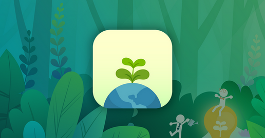
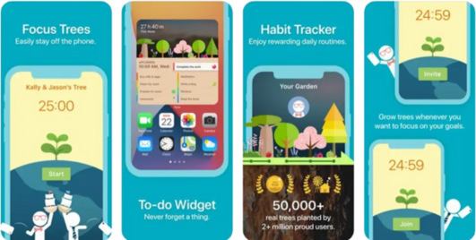
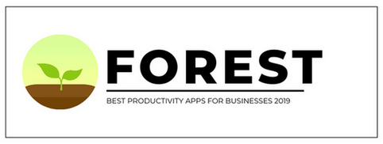
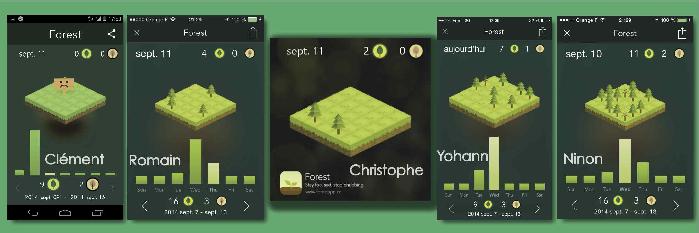
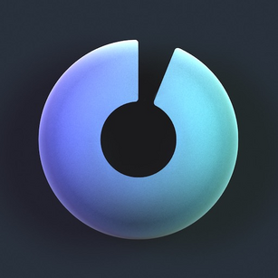
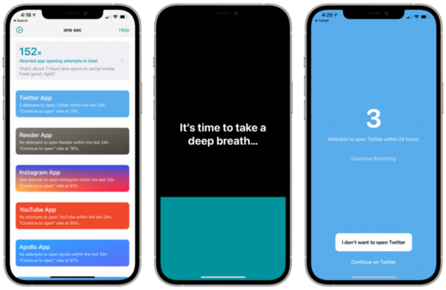
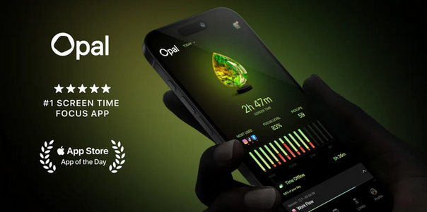
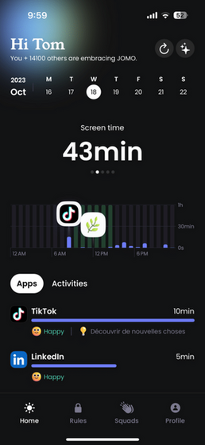
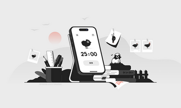
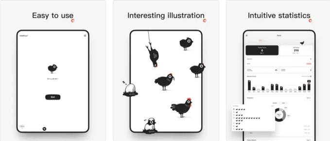

#  🌱 Timber

## 📁 Présentation des Principaux Dossiers

Une présentation des principaux dossiers de votre dépôt. Quelles sont les différentes ressources qu'il contient à la racine ? Par exemple, les maquettes, vos inspirations, etc. Si vous avez fait des efforts quant à l'organisation de vos fichiers dans le dossier `lib`, expliquez-les ici.

## 🚀 Présentation de l'Application

Timber est une application conçue pour favoriser la concentration sur des périodes définies et encourager une productivité. 

En bloquant l'utilisation du smartphone, Timber aide les utilisateurs à rester focalisés sur leurs tâches. À chaque session réussie, l’utilisateur reçoit des récompenses motivantes : une collection d'arbre virtuel de types différentes en fonction de leur temps de concentration.

Par exemple, une session ratée pourrait faire apparaître un arbre mort, tandis qu’une session réussie ferait grandir un arbre en pleine santé. Timber utilise la méthode Pomodoro, populaire pour son efficacité dans le domaine de l’étude et de la gestion du temps.

**Et ce n’est pas tout !** 
Timber propose des fonctionnalités sociales et de gamification pour rendre l’expérience encore plus engageante et motivante.

🍻 **Ajout d’amis** 
Les utilisateurs peuvent ajouter leurs amis et suivre leurs progrès, offrant une dimension sociale et encourageant une motivation collective. En voyant les jardins des autres, chacun peut s’inspirer et se challenger dans un esprit de compétition amicale.

**Timber répond a deux besoins crutiaux dans le domaine de l'étude**

1. optimisation de son temp de travail ⬆️
2. La restriction de l'usage de son smartphone 📱

### 🙈 Exploration des jardins des autres :
 Timber permet de découvrir les jardins virtuels des autres utilisateurs, ce qui ajoute un aspect visuel stimulant et donne envie de faire grandir le sien pour partager ses réussites.

### 💫 Système de récompenses et de trophées : 
Timber récompense les efforts par des trophées et des badges de cap franchi, comme le nombre de sessions complétées ou la durée totale de concentration. Ces trophées permettent aux utilisateurs de visualiser leurs progrès et de rester motivés dans le temps.

Ces éléments rendent Timber bien plus qu’un simple outil de productivité : c’est un espace où l'on peut progresser, partager, et célébrer chaque avancée avec une communauté motivée.

## 🌐 Étude de l'Existant

Le besoin de l'application est qu'il doit aider les jeunes étudiants qui n'arrivent plus à se concentrer sur un long terme sans se faire distraire par son téléphone.

Réaliser une application qui répond au besoin de bloquer l'accès à son téléphone à déjà été créé plusieurs fois abordés différemments.

La technique généralement utilisée, est la méthode Pomodore. C'est une méthode de gestion du temps qui améliore la concentration et la productivité. Elle consiste à travailler intensément pendant une période fixe, généralement 25 minutes (appelée un "Pomodoro"), suivie d'une courte pause de 5 minutes. Après quatre cycles de travail, une pause plus longue, de 15 à 30 minutes, est prise pour se reposer davantage. Cette méthode aide à structurer les sessions de travail en blocs concentrés, réduisant ainsi les distractions et augmentant l'efficacité.

### Flora

Flora est une application gratuite disponible sur l'Apple Store, Google Play ainsi que sur Chrome en tant qu'extension. Cette application mobile de concentration aide grâce à ses arbres virtuels que l'utilisateur peut planter, et va même plus loin en soutenant la plantation d'arbres réels.

En effet, Flora propose une option pour contribuer à des initiatives de reforestation : chaque session de concentration réussie aide à financer la plantation d’un véritable arbre en partenariat avec des associations écologiques. L’utilisateur peut ainsi voir ses efforts de concentration transformés en impact positif pour l'environnement.

Flora bloque les applications distrayantes comme les réseaux sociaux ou les jeux pour aider à rester concentré sur l'essentiel. À chaque début d'une session de travail, une graine virtuelle est plantée. Si l'application n'est pas quittée avant la fin de la session, la graine se transforme en un arbre. Attention toutefois, quitter l’application trop tôt fait mourir l’arbre !

Grâce à la méthode Pomodoro, Flora aide à maintenir le focus, avec des minuteurs personnalisables pour ajuster les périodes de travail et de pause.

Flora suit également la progression en fournissant des statistiques détaillées sur le temps de concentration et le nombre d'arbres plantés. Les progrès s'affichent sous forme de graphiques, offrant une vue d'ensemble inspirante du parcours de concentration et de son impact écologique.

| Avantages                                     | Inconvénients                                   |
|-----------------------------------------------|-------------------------------------------------|
| Addiction pour obtenir des arbres             | Frustration lors d'un arbre mort                |
| Aucune connexion Internet nécessaire          | Mobilise beaucoup de temps                      |
| Aucune publicité                              |                   |
| Personnalisation des minuteurs                |                   |
| Rapports et suivi de progrès                  |                   |

### Forest

Le principe de Forest repose sur l'idée de planter une graine virtuelle. Cette graine symbolise l'engagement à rester loin du téléphone. En maintenant la concentration, la graine se transforme progressivement en un arbre. Cependant, céder à la tentation et quitter l'application avant la fin du temps de concentration entraîne la mort de l’arbre.

Des outils de suivi détaillés intégrés permettent de visualiser les progrès et l'impact des efforts de concentration. Il est possible de créer et gérer des balises personnalisées, de consulter des statistiques précises sur la répartition du temps et de parcourir la forêt personnelle en vues hebdomadaires, mensuelles ou annuelles.

Forest se synchronise également avec Apple Health pour suivre le temps de concentration et offrir un aperçu de l’utilisation quotidienne du téléphone et du temps d’écran. En restant concentré, des récompenses se débloquent sous forme de nouvelles espèces d’arbres, avec plus de 90 disponibles. Divers bruits blancs sont également proposés pour améliorer l’environnement de travail.

Chaque arbre planté et chaque minute de déconnexion permet de gagner des pièces d’or. Ces pièces peuvent ensuite être utilisées pour participer à la plantation d’arbres réels avec l’association « Trees for the Future » ou pour accéder à de nouvelles graines et développer la forêt virtuelle.

Enfin, des fonctionnalités sociales permettent de se mettre en compétition ou en coopération avec d’autres utilisateurs, de rivaliser avec des personnes du monde entier ou de planter des arbres en groupe. La chronologie forestière permet de revivre chaque étape du parcours de concentration, rappelant chaque moment d’engagement pour mieux utiliser le temps.

| Avantages                                     | Inconvénients                                   |
|-----------------------------------------------|-------------------------------------------------|
| Facile d'utilisation                          | Application payante sur IOS       |
| Créer son propre jardin (très visuel)         |                   |
| Rapports et suivi de progrès                  |                   |
| Personnaliser les étiquettes pour chaque tâche afin de suivre la répartition du temps |   |

### One Sec

One Sec est une application conçue pour réduire l’addiction aux médias sociaux en ajoutant une pause réfléchie avant l’ouverture.

L’idée repose sur un concept simple et efficace : insérer une étape intermédiaire entre l’envie de consulter les réseaux sociaux et l’action elle-même. Avec One Sec, la gratification instantanée des réseaux devient moins attrayante grâce à cette petite friction ajoutée.

Cette approche aide à rompre le cycle de consultation compulsive des notifications qui fournissent une dose de dopamine. Conçue en collaboration avec des psychologues et des experts en expérience utilisateur, One Sec peut transformer la routine des utilisateurs intensifs des réseaux sociaux. Certains utilisateurs observent une réduction d’environ 50 % du temps passé sur ces plateformes, libérant ainsi des semaines entières pour d’autres activités, tout en réduisant les symptômes de stress, de dépression et d’anxiété souvent liés à l’usage excessif des réseaux.

L’efficacité de cette méthode a été confirmée par des études scientifiques menées par l’Institut Max-Planck en Allemagne et l’Université de Heidelberg.

L’installation et la configuration de One Sec sont simples sous Android et légèrement plus techniques sous iOS, où il est nécessaire d’utiliser les raccourcis Apple, mais des tutoriels détaillés guident chaque étape.

L’application permet de sélectionner les réseaux sociaux ou applications à bloquer. Lors de chaque tentative de consultation de ces plateformes, One Sec impose une pause, incitant à réfléchir aux raisons de cette ouverture. Une fois la pause écoulée, une notification rappelle l’intention initiale et invite à évaluer si elle reste pertinente ou si un changement d’avis est préférable.

L’application suit les progrès de chaque utilisateur avec des graphiques et des comparaisons inspirantes.

One Sec propose également des alternatives saines pour remplacer ces habitudes. Par exemple, au lieu d’ouvrir Facebook, One Sec peut suggérer de regarder des photos de famille, faire du sport, appeler un proche, boire de l’eau, lire quelques pages d’un livre, ou écouter de la musique ou un podcast.

Toutes ces suggestions sont personnalisables, permettant d’intégrer ses propres activités favorites pour remplacer les habitudes numériques distrayantes.

| Avantages                                     | Inconvénients                                   |
|-----------------------------------------------|-------------------------------------------------|
| Compatible avec les raccourcis iOS            | Une fois la respiration/pause finie, utilisation normale de l'app  |
| Aide à la prise de conscience                 | Facilement contournable avec un bouton          |
| Rapports et suivi de progrès                  |                              |

### Opal

Disponible en application mobile pour iPhone et en extension pour Google Chrome, Opal favorise une meilleure concentration en bloquant les applications envahissantes et en désactivant les notifications intrusives pendant des périodes définies au préalable. Durant ces plages sans sollicitations, il devient plus facile de s’éloigner des écrans et de libérer du "temps de cerveau" pour une productivité accrue.

Opal aide à réduire le temps d’écran de plusieurs heures en bloquant la connexion Internet durant des sessions de quelques minutes à plusieurs heures, selon les besoins. Bien que mettre le smartphone en mode avion ou fermer les onglets des réseaux sociaux puisse aussi limiter les distractions, Opal propose une approche ludique avec un système de récompenses et d’objectifs pour rendre l’expérience plus engageante.

Parmi les fonctionnalités, les rapports de concentration et le Focus Score permettent de mesurer le niveau de concentration et les progrès accomplis. Le bloqueur d’applications est entièrement paramétrable : il bloque les applications chronophages pour des sessions instantanées ou programmées, mais il est possible de les débloquer lors des pauses. Un calendrier personnalisé peut être établi pour inclure les heures de sommeil, de travail, et de repos, assurant ainsi un blocage automatique des distractions aux moments choisis.

Opal peut être utilisé en application mobile sur iPhone et se synchronise avec une extension pour navigateur web, permettant ainsi de bloquer les sites et réseaux sociaux directement depuis le navigateur.

| Avantages                                     | Inconvénients                                   |
|-----------------------------------------------|-------------------------------------------------|
| Très personnalisable                          | Pas disponible sur le Play Store                |
| Rapports et suivi de progrès                  | Fonctionnalitées limitées pour la version gratuite  |

### ChickFocus

Chick Focus est un minuteur Pomodoro qui rend le travail et les études plus ludiques en intégrant un jeu de croissance de poussins. À chaque lancement du compte à rebours, un poussin commence à grandir. Une fois le temps écoulé, le poussin atteint l’âge adulte, mais toute interruption de la session de concentration entraîne la mort du poussin. Ce mécanisme incite à rester concentré pour le faire grandir avec succès !

Avec une interface ultra-légère, Chick Focus prend très peu d’espace sur le téléphone et se télécharge rapidement. Aucun apprentissage n'est nécessaire : dès l'ouverture, l’application est prête à l’emploi. Son interface intuitive et simplifiée rend l’utilisation facile et accessible à tous.

| Avantages                                     | Inconvénients                                   |
|-----------------------------------------------|-------------------------------------------------|
| Facile d'utilisation                          | Fonctionnalitées limitées pour la version gratuite  |
| Prend peu d'espace mémoire                    |                |
| Disign très minimaliste                       |                |

## 🎯 Public Cible

Notre application s'adresse avant tout aux étudiants, aux professionnels en milieu de travail, et même aux sportifs – toutes les personnes qui cherchent à rester concentrées sur une tâche, que ce soit pour des durées courtes ou plus longues.

Nous avons conçu Timber en tenant compte des besoins variés de ce public :

- 🧑‍💻 **Étudiants** : 

    Timber aide à structurer les sessions d’étude en décourageant l’utilisation du smartphone et en rendant chaque session productive et motivante.

 - 👔 **Professionnels**:
 
    En milieu de travail, Timber permet de gérer efficacement le temps et d'éviter les distractions, tout en donnant des indicateurs de progrès concrets pour rester motivé.

- 🧑‍💻 **Sportifs**:

     Pour ceux qui s’entraînent, Timber peut servir à maintenir la concentration pendant les routines et les exercices, en les aidant à rester mentalement dans l’effort.

- **Lecteurs**:

    Pour les lecteurs, Timber peut également servir à séloigné du téléphone pendant une scéance de lecture, afin d'oublié son utilisation.

En intégrant des récompenses visuelles comme la croissance d’une collection d'arbre virtuel, Timber motive chaque utilisateur à continuer dans la durée, en s’adaptant à leurs besoins spécifiques, que ce soit pour des tâches courtes ou de longue durée. 

## 📋 Fonctionnalités

### Persona 1 : Théo, Étudiant en droit

Contexte : Théo est un étudiant qui prépare ses examens. Il utilise cette application pour mieux se concentrer sur ses séances de révision, en bloquant les distractions et en structurant son temps.

*Récit Utilisateur 1 :*

- **En tant que :** Théo, utilisateur de l’application cherchant à se concentrer
- **Je veux :** pouvoir définir une durée de concentration personnalisée (ex. 25, 50, 90 minutes)
- **Afin de :** planifier mes révisions en cycles de travail et de pause, et améliorer ma productivité.

*Récit Utilisateur 2 :*

- **En tant que :** Théo, utilisateur récurrent
- **Je veux :** pouvoir visualiser mon historique de sessions de concentration (nombre de sessions, durée, jours de la semaine, etc.)
- **Afin de :** suivre mes progrès et identifier mes meilleures périodes de concentration pour m’améliorer.

*Récit Utilisateur 3 :*

- **En tant que :** Théo, étudiant soucieux de sa motivation
- **Je veux :** gagner des « points de concentration » après chaque session complète
- **Afin de :** m’encourager à rester concentré et persévérer en suivant mes progrès.

### Persona 2 : Clara, Professionnelle en télétravail
Contexte : Clara est consultante en marketing et travaille depuis chez elle. Elle utilise l’application pour structurer sa journée de travail et minimiser les distractions.

*Récit Utilisateur 1 :*

- **En tant que :** Clara, utilisatrice en télétravail
- **Je veux :** activer une option de blocage des notifications sur mon téléphone pendant mes sessions de concentration
- **Afin de :** éviter les interruptions et rester productive pendant mes sessions de travail.

*Récit Utilisateur 2 :*

- **En tant que :** Clara, utilisatrice souhaitant mieux gérer son équilibre travail-vie personnelle
-  **Je veux :** recevoir des rappels pour faire des pauses régulières entre mes sessions
- **Afin de :** éviter l’épuisement et maintenir un bon équilibre de vie.

### Persona 3 : Hugo, Adolescent qui se distrait facilement
Contexte : Antoine est au lycée et se distrait facilement en utilisant son téléphone. Il utilise l’application pour essayer de se concentrer plus efficacement sur ses devoirs.

*Récit Utilisateur 1 :*

- **En tant que :** Antoine, utilisateur facilement distrait
- **Je veux :** recevoir des encouragements ou des badges lorsque je complète plusieurs sessions de concentration sans interruption
- **Afin de :** me motiver à rester concentré et rendre l’expérience plus ludique.

*Récit Utilisateur 2 :*

- **En tant que :** Antoine, utilisateur en quête de compétition
- **Je veux :** pouvoir comparer mon score de concentration avec mes amis
- **Afin de :** transformer l’étude en un défi amical et me motiver à progresser.

## 📈 État d'Avancement

>  Un état d'avancement pour chaque fonctionnalité de votre application. Ceci doit évidemment être mis à jour régulièrement. Dès lors que vous aurez terminé de programmer une fonctionnalité, ajoutez dans le document `readme.md` un `.gif` qui l'illustre. Vous pouvez vous servir de [GIF Brewery](https://apps.apple.com/us/app/gif-brewery-3-by-gfycat/id1081413713?mt=12) (Si vous êtes sous macOS) ou de [Gyazo](https://gyazo.com) (Si vous êtes sous Windows).

## ⚙️ Compilation de l'Application

> Enfin, nous vous demandons d'ajouter une section pour les dev où vous expliquez ce qu'il faut faire pour pouvoir compiler l'application. Cette documentation doit être simple et surtout efficace.
